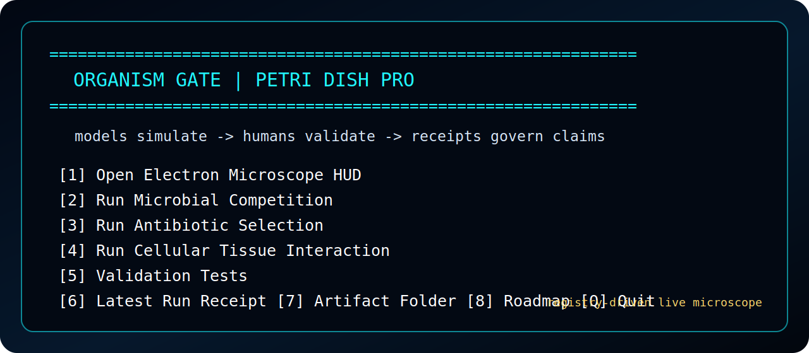

# Entry Point: Organism Gate

The primary human-facing entry point is the **Organism Gate** terminal menu. It is the control surface that opens the Electron microscope HUD, runs simulation presets, executes validation tests, and opens receipts/artifacts.



## Terminal menu contract

```text
ORGANISM GATE | PETRI DISH PRO

models simulate -> humans validate -> receipts govern claims

[1] Open Electron Microscope HUD
[2] Run Microbial Competition
[3] Run Antibiotic Selection
[4] Run Cellular Tissue Interaction
[5] Validation Tests
[6] Latest Run Receipt
[7] Open Artifact Folder
[8] Roadmap
[Q] Quit
```

## Launch

From the repository root:

```powershell
powershell -NoProfile -ExecutionPolicy Bypass -File .\ORGANISM_GATE.ps1
```

Alternative Windows launcher:

```powershell
.\START_ORGANISM_GATE.bat
```

## Operating model

1. Clone the repository.
2. Launch the Organism Gate entry point from the repository root.
3. Use option `[1]` to open the Electron microscope HUD.
4. Use preset options to run educational organism simulations.
5. Use validation and receipt options before making public claims.
6. Treat receipts and claim boundaries as part of the application state.

## Claim boundary

PetriDishPro is an educational simulation environment. It is not a wet-lab protocol, clinical tool, dosing engine, diagnostic engine, susceptibility test, treatment guide, or biosafety system.
